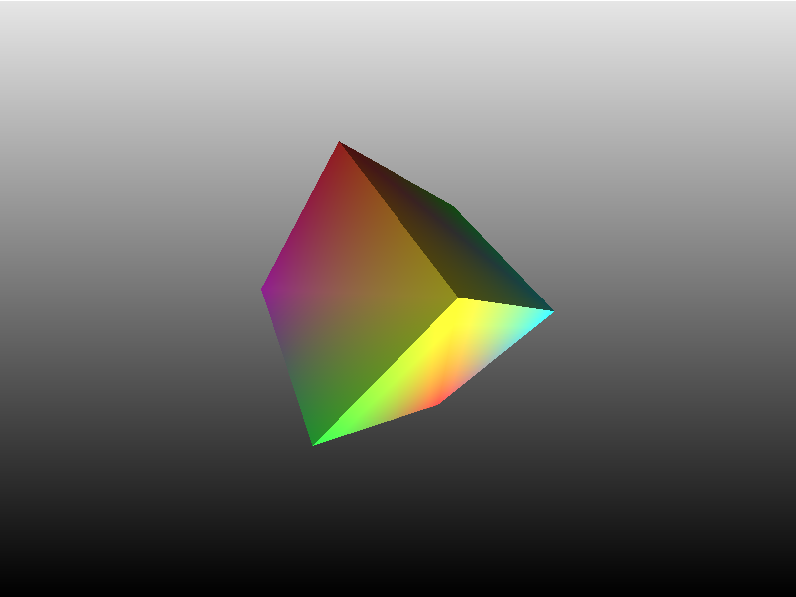
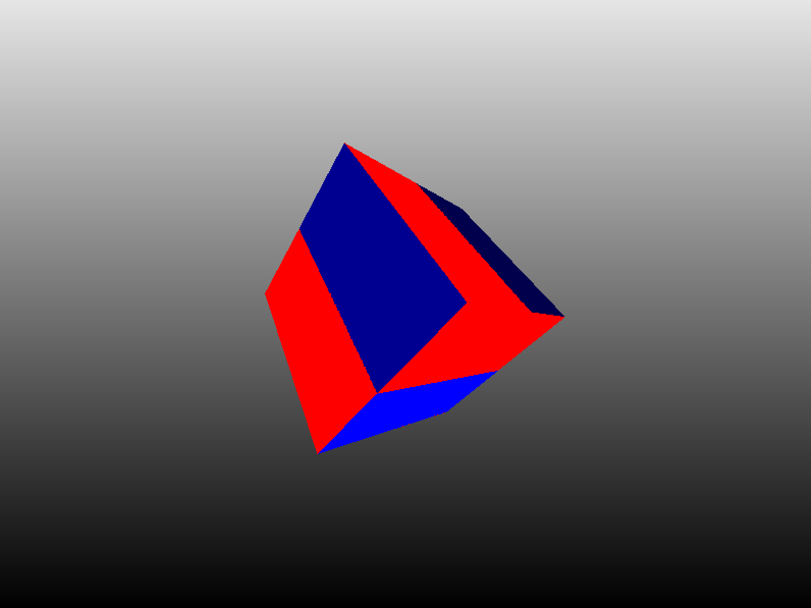
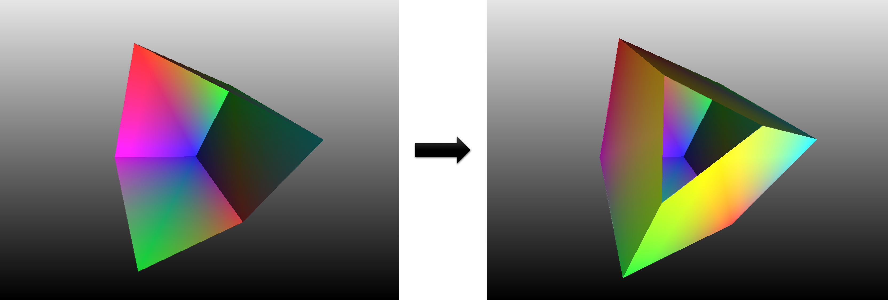

#SoftRasterization

图形学课程项目：实现一个软光栅化渲染器。

项目的实现基本上参考了skywind3000的mini3d教程项目，实现了一个比较简单的渲染器。本小组在阅读源码学习的同时，将代码重新梳理了一下，并对其中的问题和可改进的地方做了一些修改，增加了一些feature。

原始链接：https://github.com/skywind3000/mini3d.git

### New Features

- 光照

  增加了一个简单的平行光照系统，包括环境光和漫反射，phong模型的镜面反射的部分在原先的代码结构上实现起来比较困难，因而没有进行实践。

  

- 纹理

  从文件读取纹理。

  

- 裁剪

  原先的裁剪算法是根据三角面的顶点在裁剪空间以外，则完全剔除整个三角面。

  改进的算法则利用递归来切割三角形，进行更细粒度的裁剪。

  

  